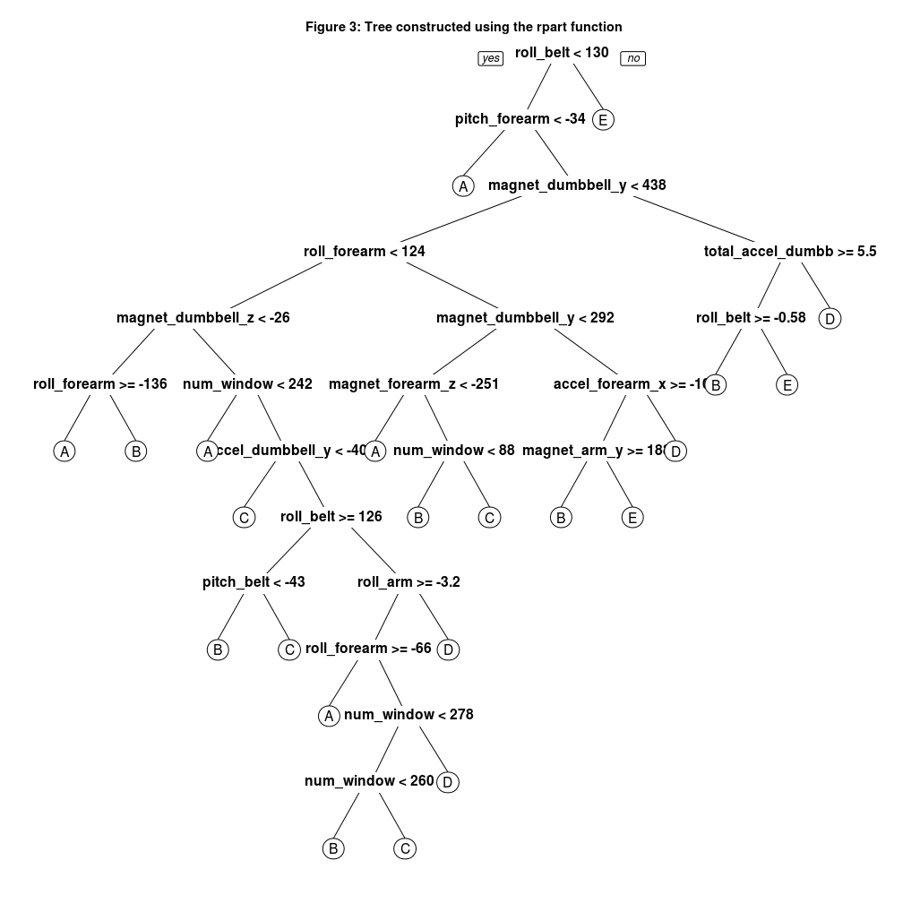

# Classifying barbell lifts

## Practical Machine Learning Peer Assessment

### July 2014

## Introduction

Using devices such as Jawbone Up, Nike FuelBand, and Fitbit it is now possible to collect a large amount of data about personal activity relatively inexpensively. One thing that people regularly do is quantify how much of a particular activity they do, but they rarely quantify how well they do it. Here we investigate a dataset where 6 participants were asked to perform barbell lifts correctly and incorrectly in 5 different ways, with accelerometers on the belt, forearm, arm, and dumbell. We build a classification model that can classify which way the participant is lifting the barbell, and then check this classification model against a test data set. 

More information about this dataset is available from the [website (1)](#ref1) specifically the section on the Weight Lifting Exercise Dataset. The [training data set(2)](#ref2) and the [testing data set (3)](#ref3) are also available.

## Methods

### Getting and preparing the data

First we load the training and testing data sets. Here it was necessary to pay attention to the fact that missing values could be represented in several ways, either by an `NA`, a totally empty value or `#DIV/0!` indicating a divide by zero error. In order to avoid numerical variables being erroneously converted to factor variables it was necessary to convert these values explicitly to NAs:


```r
train <- read.csv("data/pml-training.csv", na.strings = c("NA", "", "#DIV/0!"))
test <- read.csv("data/pml-testing.csv", na.strings = c("NA", "", "#DIV/0!"))
summary(train$classe)
```

```
##    A    B    C    D    E 
## 5580 3797 3422 3216 3607
```


Second, examining the dataset, it is apparent that the different values of `classe` are grouped in sequential order so a model could appear to do very well just classifying based on the index. Therefore it is important to remove the id column, `x`, and any other column which could be used to place the values is sequential order such as timestamps. Also the names of the people who supplied the data are also grouped in sequential order so they need to be removed as well: 


```r
drops <- c("user_name", "raw_timestamp_part_1", "raw_timestamp_part_2", "cvtd_timestamp", 
    "X", "new_window")
train.k <- train[, !(names(train) %in% drops)]
test.k <- test[, !(names(test) %in% drops)]
```


Third, examining the dataset it was apparent that some columns had a lot of missing values, so we calculate how many missing values each column has and remove any columns that have too many missing values:


```r
n <- dim(train.k)[2]
naCols <- vector(length = n)
for (i in 1:n) {
    naCols[i] <- sum(is.na(train.k[, i]))
}
train.s <- train.k[, which(naCols < 10)]
test.s <- test.k[, which(naCols < 10)]
```


Fourth, we we subdivide the training set to create a cross validation set. We allocate 70% of the original training set to the new training set, and the other 30% to the cross validation set:


```r
library(caret)
inTrain <- createDataPartition(y = train.s$classe, p = 0.7, list = FALSE)
training <- train.s[inTrain, ]
train.cv <- train.s[-inTrain, ]
```


### Classification and regression trees

First we will investigate using classification and regression trees as proposed by [Breiman (4)](#ref4) and [Ripley (5)](#ref5):


```r
library(tree)
fit1 <- tree(classe ~ ., method = "tree", data = training)
p1 <- predict(fit1, type = "class")
table(training$classe, p1)
```

```
##    p1
##        A    B    C    D    E
##   A 3367  449   17   24   49
##   B  289 2013  129  227    0
##   C   37  128 1952  279    0
##   D   32  555  294 1270  101
##   E   90  309  149   98 1879
```

```r
fit1.prune <- prune.misclass(fit1, best = 10)
```


Figure 2 shows a pruned version of the generated tree in order to make the diagram legible. The full tree has 22 nodes so it is rather complex.


```r
plot(fit1.prune)
title(main = "Figure 1: Tree created using tree function")
text(fit1.prune, cex = 1.2)
```

 

Does this complexity mean the tree is overfitting? We will investigate this using pruning. First though, we will estimate the in-sample error:


```r
nright = table(p1 == training$classe)
tree_in_error = as.vector(100 * (1 - nright["TRUE"]/sum(nright)))
```


We estimate the in-sample error to be **23.7024 %**. Next, how does the tree perform on cross-validation set?


```r
p2 <- predict(fit1, newdata = train.cv, type = "class")
table(train.cv$classe, p2)
```

```
##    p2
##        A    B    C    D    E
##   A 1423  204   13    9   25
##   B  148  868   44   79    0
##   C   20   60  828  118    0
##   D   10  226  147  536   45
##   E   41  128   45   53  815
```

```r
nright = table(p2 == train.cv$classe)
tree_out_error = as.vector(100 * (1 - nright["TRUE"]/sum(nright)))
```


We estimate the out-of-sample error to be **24.0442 %**. Can we improve performance on cross-validation set by pruning?


```r
error.cv <- {
    Inf
}
for (i in 2:19) {
    prune.data <- prune.misclass(fit1, best = i)
    pred.cv <- predict(prune.data, newdata = data.cv, type = "class")
    nright = table(pred.cv == data.cv$classe)
    error = as.vector(100 * (1 - nright["TRUE"]/sum(nright)))
    error.cv <- c(error.cv, error)
}
error.cv
```

```
##  [1]   Inf 63.21 50.13 50.13 50.13 50.13 47.41 42.43 42.43 39.78 37.81
## [12] 34.63 34.63 32.01 32.01 30.40 29.29 28.38 26.05
```

```r
plot(error.cv, type = "l", xlab = "Size of tree (number of nodes)", ylab = "Out of sample error(%)", 
    main = "Figure 2: Relationship between tree size and out of sample error")
```

 


Despite the complexity of the tree in Figure 1, Figure 2 does not indicate overfitting as the out of sample error does not increase as more nodes are added to the tree. 

### RPart trees

Next we will use a different type of classification and regression tree implemented by rpart, also as proposed by as proposed by [Breiman (4)](#ref4):


```r
fit2 <- rpart(classe ~ ., data = training)
p3 <- predict(fit2, type = "class")
table(training$classe, p3)
```

```
##    p3
##        A    B    C    D    E
##   A 3439  225   81  131   30
##   B  322 1769  244  253   70
##   C   94  284 1954   50   14
##   D   99  201  398 1340  214
##   E   25  149  110  188 2053
```

```r
library(rpart.plot)
prp(fit2, cex = 1.3)
title(main = "Figure 3: Tree constructed using the rpart function")
```

 


Looking at the trees in Figure 1 and Figure 3 although the diagrams are different because they come from different packages there are similarities in the decisions they are using.


```r
cp <- fit2$cp
plot(cp[, 2], cp[, 3], typle = "l", xlab = "Size of tree (number of nodes", 
    ylab = "Out of sample error (%)", main = "Figure 4: Relationship between tree size and out of sample error")
```

```
## Warning: "typle" is not a graphical parameter
## Warning: "typle" is not a graphical parameter
## Warning: "typle" is not a graphical parameter
## Warning: "typle" is not a graphical parameter
## Warning: "typle" is not a graphical parameter
## Warning: "typle" is not a graphical parameter
```

 

Next we estimate the in-sample error:


```r
nright = table(p3 == training$classe)
rpart_in_error = as.vector(100 * (1 - nright["TRUE"]/sum(nright)))
```


We estimate the in-sample error to be **23.1637 %** so it does slightly better than the `tree` package. Next, how does the tree perform on cross-validation set?


```r
p4 <- predict(fit2, newdata = train.cv, type = "class")
table(train.cv$classe, p4)
```

```
##    p4
##        A    B    C    D    E
##   A 1451  107   27   71   18
##   B  142  752   88  106   51
##   C   41  133  823   24    5
##   D   35   82  182  561  104
##   E   11   67   40   67  897
```

```r
nright = table(p4 == train.cv$classe)
rpart_out_error = as.vector(100 * (1 - nright["TRUE"]/sum(nright)))
```


We estimate the out-of-sample error to be **23.8063 %**. Again this is an improvement on `tree`. 

### Random forests

Next we apply random forests also proposed by [Breiman (6)](#ref6) and [Breiman (7)](#ref7):


